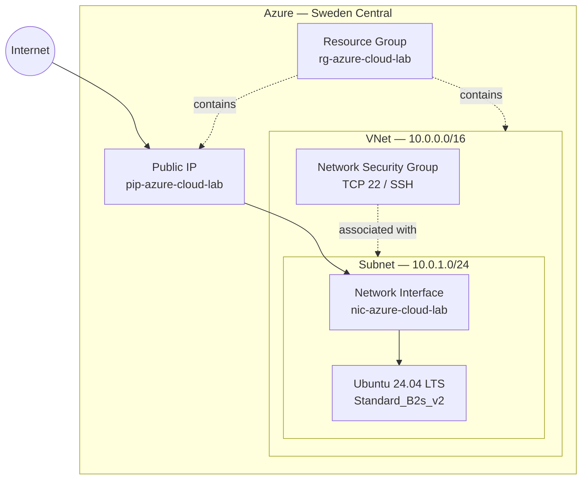
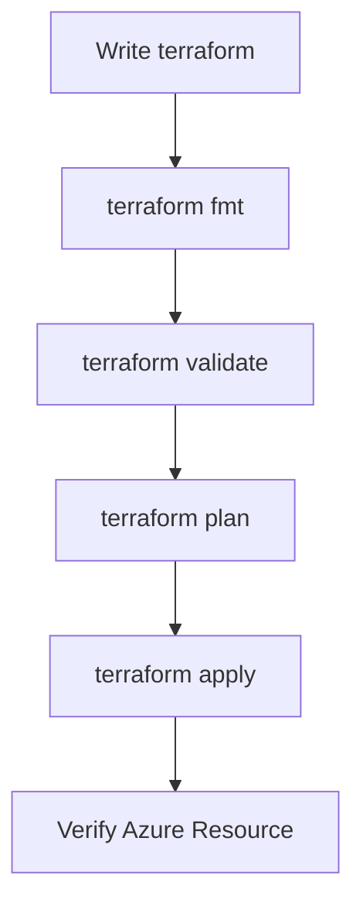

# Azure cloud lab

A hands-on Azure infrastructure project built with Terraform.
The goal of this project is to learn and demonstrate practical cloud engineering concepts including Infrastructure as Code (IaC), Azure networking, Linux virtual machines, network security, SSH access, and infrastructure lifecycle management.

## Table of Contents

- [Architecture](#architecture)
  - [Infrastructure](#infrastructure)
  - [Network](#network)
- [Terraform](#terraform)
  - [Validation](#validation)
- [Deployment](#deployment)
- [SSH Access](#ssh-access)
- [Security](#security)
  - [Future Security Improvements](#future-security-improvements)
- [Lessons Learned](#lessons-learned)
  - [Infrastructure as Code](#infrastructure-as-code)
  - [Azure Resource Availability](#azure-resource-availability)
  - [Networking](#networking)
  - [Git and Terraform](#git-and-terraform)
- [Project Status](#project-status)
  - [V1.0 — Complete](#v10--complete)
  - [Planned V2](#planned-v2)
- [Technologies](#technologies)

## Architecture



## Infrastructure

The V1 deployment contains:

- Resource Group — rg-azure-cloud-lab
- Virtual Network — vnet-azure-cloud-lab
- Subnet — subnet-azure-cloud-lab
- Network Security Group — nsg-azure-cloud-lab
- Public IP — pip-azure-cloud-lab
- Network Interface — nic-azure-cloud-lab
- Linux Virtual Machine — vm-azure-cloud-lab
- Ubuntu 24.04 LTS

## Network

| Resource | Configuration |
| :--- | :--- |
| **VNet** | `10.0.0.0/16` |
| **Subnet** | `10.0.1.0/24` |
| **VM Private IP** | `10.0.1.4` |

The VM is connected to the subnet through an Azure Network Interface and is assigned a public IP for remote administration.

## Terraform

The infrastructure is defined as code using Terraform and the AzureRM provider.

```
terraform/
├── main.tf
├── variables.tf
├── outputs.tf
└── .terraform.lock.hcl

```

Terraform is used to:

- Create the Azure resource group
- Create the virtual network
- Create the subnet
- Configure network security
- Create the public IP
- Create the network interface
- Deploy the Ubuntu virtual machine

## Validation

The configuration is validated before deployment:

```
terraform fmt
terraform validate
terraform plan
terraform apply
```

## Deployment

 The project was deployed to Azure Sweden Central.

| Property | Value |
| :--- | :--- |
| **OS** | Ubuntu 24.04 LTS |
| **Architecture** | `x86_64` |
| **VM Size** | `Standard_B2s_v2` |
| **Disk** | `Standard_LRS` |
| **Access** | SSH |

 The deployment encountered Azure regional and capacity restrictions during development. The project was adapted by selecting an available Azure region and VM SKU.
This was an intentional part of the learning process: Azure resource availability can depend on subscription, region, SKU and current capacity.

## SSH Access

The VM is accessed using an ED25519 SSH key.
Example:

```
ssh -i ~/.ssh/azure-cloud-lab azureuser@<PUBLIC_IP>

```

Password authentication is disabled.
Once connected, basic Linux and networking functionality was verified:

```

uname -a
lsb_release -a
ip addr
df -h
curl https://google.com
```

The VM successfully received a private address from the Azure subnet and had outbound Internet connectivity.

## Security

The V1 network security configuration allows inbound SSH:

| Setting | Value |
| :--- | :--- |
| **Protocol** | TCP |
| **Port** | `22` |
| **Direction** | Inbound |
| **Source** | Any (`*`) |

> **Security note:** SSH is currently exposed to the Internet from any source (`0.0.0.0/0`). This is acceptable for this learning lab but should be restricted before using the infrastructure for anything beyond the lab.

## Future security improvements

The current configuration is intentionally simple for the V1 lab. Future versions will improve the security model by:

- Restricting SSH to a specific source IP
- Removing unnecessary public exposure
- Exploring Azure Bastion
- Using managed identities
- Improving secret/key management
- Adding monitoring and logging

## Azure Resources

The deployed resources can be inspected using the Azure CLI:

```
az resource list \
  --resource-group rg-azure-cloud-lab \
  --output table
```

Then create the screenshot:

```
az resource list --resource-group rg-azure-cloud-lab --output table
```


The V1 deployment consists of a resource group containing the network,
security, public IP, network interface, and Ubuntu virtual machine.

## Lessons Learned

### Infrastructure as Code

Terraform makes the infrastructure reproducible and allows changes to be reviewed before they are applied.
The workflow used throughout the project was:



### Azure Resource Availability

Not every VM SKU is necessarily available in every Azure region or for every subscription.
During deployment, Azure returned:
`SkuNotAvailable`
The VM size was changed after checking available SKUs for the selected region.
The networking deployment also required changing from North Europe to Sweden Central because of Azure subscription region restrictions.

### Networking

The project provided practical experience with:

- CIDR addressing
- VNets
- Subnets
- Private IP addresses
- Public IP addresses
- Network Interfaces
- Network Security Groups
- SSH connectivity
- Outbound Internet access

### Git and Terraform

Terraform-generated state and provider binaries should not be committed to Git.
The repository therefore excludes:
.terraform/
terraform.tfstate
terraform.tfstate.backup
terraform.tfvars

while keeping:
.terraform.lock.hcl
for provider version locking.

## Project Status

### V1.0 — Complete

Implemented:

- [x] Azure Resource Group
- [x] Azure VNet
- [x] Azure Subnet
- [x] Network Security Group
- [x] Public IP
- [x] Network Interface
- [x] Ubuntu Linux VM
- [x] SSH access
- [x] Terraform deployment
- [x] Infrastructure validation
- [x] Git version control

### Planned V2

The next stage will move beyond basic infrastructure and introduce more cloud engineering concepts:

- Deploy an application to the VM
- Add Azure monitoring
- Add logging
- Add health checks
- Add CI/CD with GitHub Actions
- Introduce remote Terraform state
- Improve network security
- Automate infrastructure testing
- Explore container deployment

## Technologies

- Microsoft Azure
- Terraform
- Azure CLI
- Linux / Ubuntu
- Git / GitHub
- SSH
- Networking
- Infrastructure as Code
- Cloud Networking
