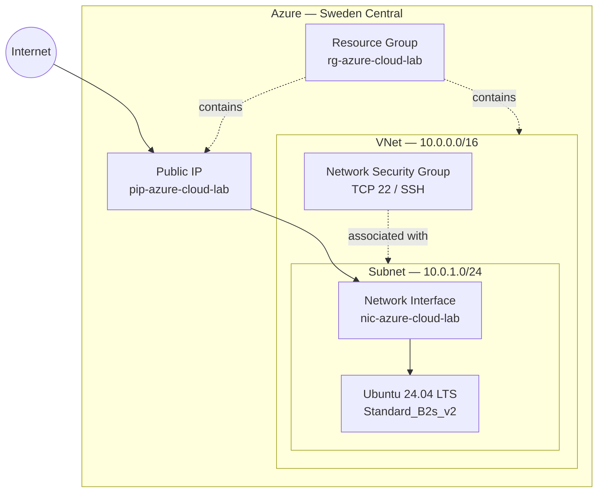
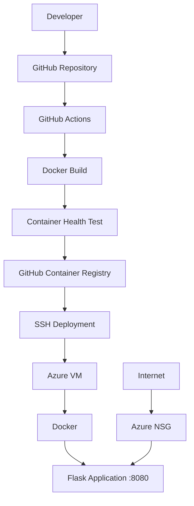
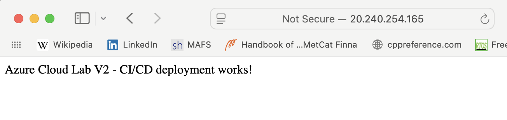
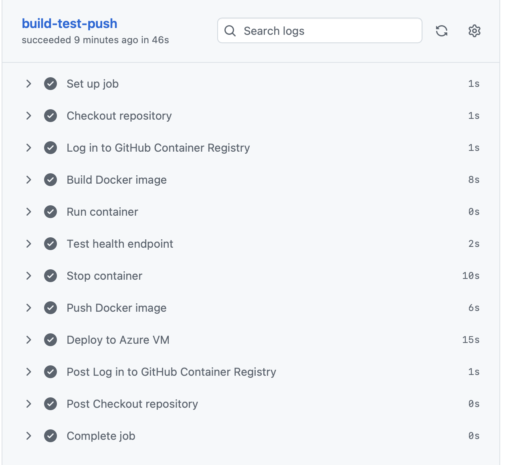
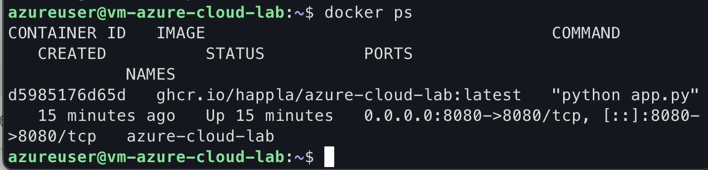
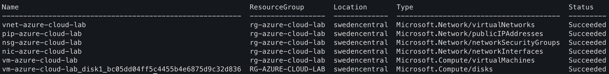
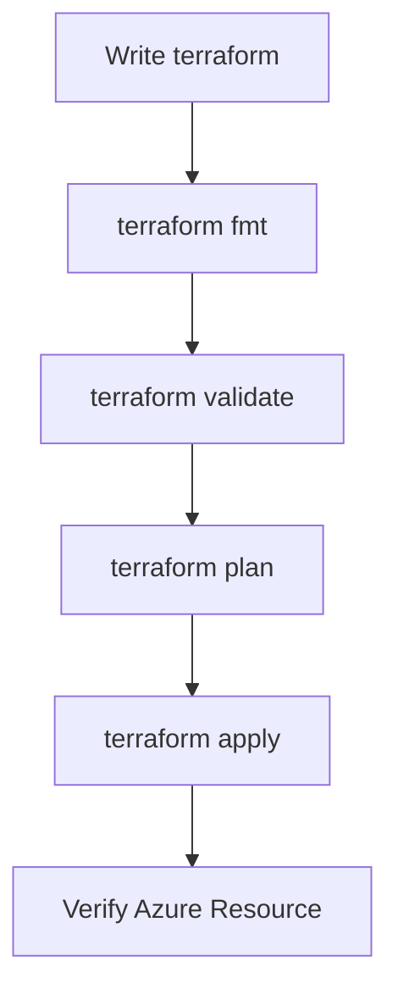

# Azure cloud lab

A hands-on Azure infrastructure project built with Terraform, Docker and Github Actions.

The project started as an Infrastructure as Code (IaC) lab and has evolved into an end-to-end cloud deployment platform.

## Table of Contents

- [Architecture](#architecture)
  - [V1 Infrastructure](#v1-infrastructure)
  - [V2 CI/CD & container deployment](#v2-cicd-and-container-deployment)
- [Infrastructure](#infrastructure)
- [Network](#network)
- [Terraform](#terraform)
- [Docker](#docker)
- [CI/CD](#cicd)
- [Validation](#validation)
- [Deployment](#deployment)
- [SSH Access](#ssh-access)
- [Security](#security)
  - [Future Security Improvements](#future-security-improvements)
- [Lessons Learned](#lessons-learned)
  - [Infrastructure as Code](#infrastructure-as-code)
  - [Azure Resource Availability](#azure-resource-availability)
  - [Networking](#networking)
  - [Git and Terraform](#git-and-terraform)
- [Project Status](#project-status)
  - [V1.0 - Complete](#v10--complete)
  - [V2 - Complete](#v2-complete)
  - [Planned V3](#planned-v3)
- [Technologies](#technologies)
- [Repository structure](#repository-structure)

## Architecture

### V1 Infrastructure



### V2 CI/CD and Container Deployment



V2 extends the original infrastructure by automatically building, testing, publishing, and deploying the application whenever changes are pushed to the development branch.



## Infrastructure

The V1 deployment contains:

- Resource Group — rg-azure-cloud-lab
- Virtual Network — vnet-azure-cloud-lab
- Subnet — subnet-azure-cloud-lab
- Network Security Group — nsg-azure-cloud-lab
- Public IP — pip-azure-cloud-lab
- Network Interface — nic-azure-cloud-lab
- Linux Virtual Machine — vm-azure-cloud-lab
- Ubuntu 24.04 LTS

V2 adds:

- Docker
- Flask application
- GitHub Actions
- GitHub Container Registry
- Automated SSH deployment
- TCP port 8080

## Network

| Resource | Configuration |
| :--- | :--- |
| **VNet** | `10.0.0.0/16` |
| **Subnet** | `10.0.1.0/24` |
| **VM Private IP** | `10.0.1.4` |

The VM is connected to the subnet through an Azure Network Interface and is assigned a public IP for remote administration.

## Terraform

The infrastructure is defined as code using Terraform and the AzureRM provider.

```
terraform/
├── main.tf
├── variables.tf
├── outputs.tf
└── .terraform.lock.hcl

```

Terraform is used to:

- Create the Azure resource group
- Create the virtual network
- Create the subnet
- Configure network security
- Create the public IP
- Create the network interface
- Deploy the Ubuntu virtual machine

## Docker

The Flask application is packaged as a Docker image and runs on the Azure VM.

The image:

- Uses Python 3.13 slim
- Installs Flask from `requirements.txt`
- Exposes port 8080
- Runs the Flask application

The image is built locally with:

```
docker build -t azure-cloud-lab:v2 .
```

The same image is built by GitHub Actions and published to GitHub Container Registry:

```
ghcr.io/happla/azure-cloud-lab:latest
```

## CI/CD

GitHub Actions automates the application deployment process.

The pipeline performs:

1. Checkout repository
2. Build Docker image
3. Start the container
4. Test `/health`
5. Push the image to GHCR
6. SSH into the Azure VM
7. Pull the latest image
8. Stop the previous container
9. Start the new container

The deployment uses a dedicated SSH key stored as a GitHub Actions secret.



## Validation

The configuration is validated before deployment:

```
terraform fmt
terraform validate
terraform plan
terraform apply
```

## Deployment

 The project was deployed to Azure Sweden Central.

| Property | Value |
| :--- | :--- |
| **OS** | Ubuntu 24.04 LTS |
| **Architecture** | `x86_64` |
| **VM Size** | `Standard_B2s_v2` |
| **Disk** | `Standard_LRS` |
| **Access** | SSH |

 The deployment encountered Azure regional and capacity restrictions during development. The project was adapted by selecting an available Azure region and VM SKU.
This was an intentional part of the learning process: Azure resource availability can depend on subscription, region, SKU and current capacity.

## SSH Access

The VM is accessed using an ED25519 SSH key.
Example:

```
ssh -i ~/.ssh/azure-cloud-lab azureuser@<PUBLIC_IP>

```

Password authentication is disabled.
Once connected, basic Linux and networking functionality was verified:

```

uname -a
lsb_release -a
ip addr
df -h
curl https://google.com
```

The VM successfully received a private address from the Azure subnet and had outbound Internet connectivity.



## Security

The V2 network security configuration allows inbound SSH:

| Setting | Value |
| :--- | :--- |
| **SSH** | TCP 22 |
| **Application** | TCP 8080 |
| **Direction** | Inbound |
| **Source** | Any (`*`) |

> **Security note:** SSH is currently exposed to the Internet from any source (`0.0.0.0/0`). This is acceptable for a learning lab but should be restricted before using the infrastructure for anything beyond the lab. SSH hardening is planned for V3.

> port 8080 is required for the public Flask application.

## Future security improvements

The current configuration is intentionally simple for this learning lab. Future versions will improve the security model by:

- Restricting SSH to a specific source IP
- Removing unnecessary public exposure
- Exploring Azure Bastion
- Using managed identities
- Improving secret/key management
- Adding monitoring and logging

## Azure Resources

The deployed resources can be inspected using the Azure CLI:

```
az resource list \
  --resource-group rg-azure-cloud-lab \
  --output table
```



The V1 deployment consists of a resource group containing the network,
security, public IP, network interface, and Ubuntu virtual machine.

### Infrastructure as Code

Terraform makes the infrastructure reproducible and allows changes to be reviewed before they are applied.
The workflow used throughout the project was:



### Azure Resource Availability

Not every VM SKU is necessarily available in every Azure region or for every subscription.
During deployment, Azure returned:
`SkuNotAvailable`
The VM size was changed after checking available SKUs for the selected region.
The networking deployment also required changing from North Europe to Sweden Central because of Azure subscription region restrictions.

### Networking

The project provided practical experience with:

- CIDR addressing
- VNets
- Subnets
- Private IP addresses
- Public IP addresses
- Network Interfaces
- Network Security Groups
- SSH connectivity
- Outbound Internet access

### Git and Terraform

Terraform-generated state and provider binaries should not be committed to Git.
The repository therefore excludes:

```text
.terraform/
terraform.tfstate
terraform.tfstate.backup
terraform.tfvars

```

while keeping:
.terraform.lock.hcl
for provider version locking.

## Project Status

### V1.0 — Complete

Implemented:

- [x] Azure Resource Group
- [x] Azure VNet
- [x] Azure Subnet
- [x] Network Security Group
- [x] Public IP
- [x] Network Interface
- [x] Ubuntu Linux VM
- [x] SSH access
- [x] Terraform deployment
- [x] Infrastructure validation
- [x] Git version control

### V2 - Complete

Implemented:

- [x] Flask application
- [x] Docker containerization
- [x] Application health endpoint
- [x] GitHub Actions CI/CD
- [x] Docker image build
- [x] Container health testing
- [x] GitHub Container Registry
- [x] Automated SSH deployment
- [x] Azure VM container deployment
- [x] Public application endpoint
- [x] Terraform-managed application port
- [x] Dedicated deployment SSH key

### Planned V3

- [ ] Azure monitoring
- [ ] Centralized logging
- [ ] HTTPS/TLS
- [ ] Reverse proxy
- [ ] Kubernetes
- [ ] Prometheus/Grafana
- [ ] Azure managed identity
- [ ] GitHub Actions OIDC
- [ ] Remote Terraform state
- [ ] Infrastructure testing
- [ ] Improved network security

## Technologies

- Microsoft Azure
- Terraform
- Azure CLI
- Linux / Ubuntu
- Git / GitHub
- SSH
- Networking
- Infrastructure as Code
- Cloud Networking

## Repository Structure

```
.
├── .github/
│   └── workflows/
│       └── ci.yml
├── app/
│   ├── app.py
│   └── requirements.txt
├── docs/
│   ├── azure-resources.png
│   ├── docker-container.png
│   ├── github-actions.png
│   └── running-app.png
├── terraform/
│   ├── main.tf
│   ├── variables.tf
│   ├── outputs.tf
│   └── .terraform.lock.hcl
├── .dockerignore
├── .gitignore
├── Dockerfile
└── README.md

```

[Back to top](#top)
